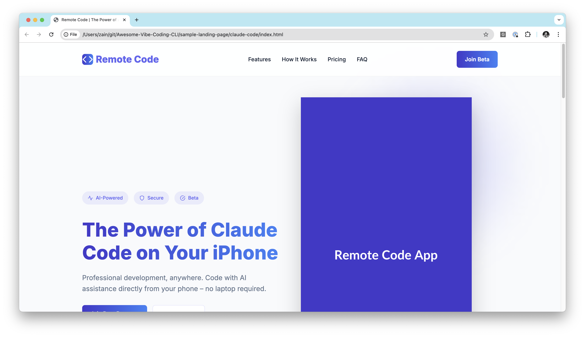
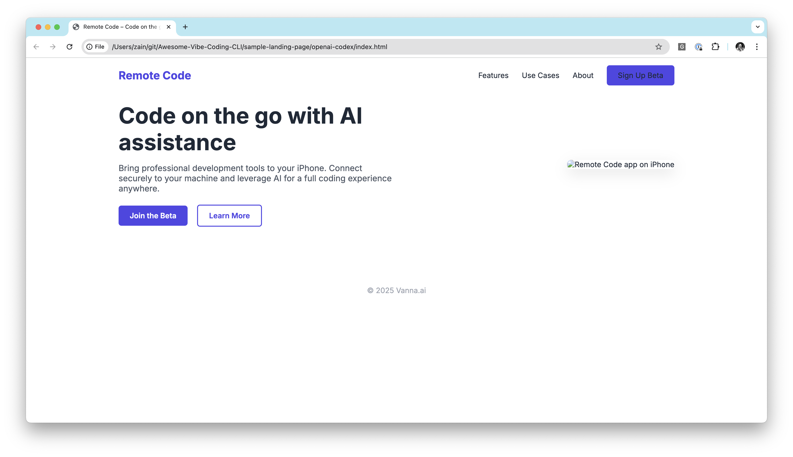
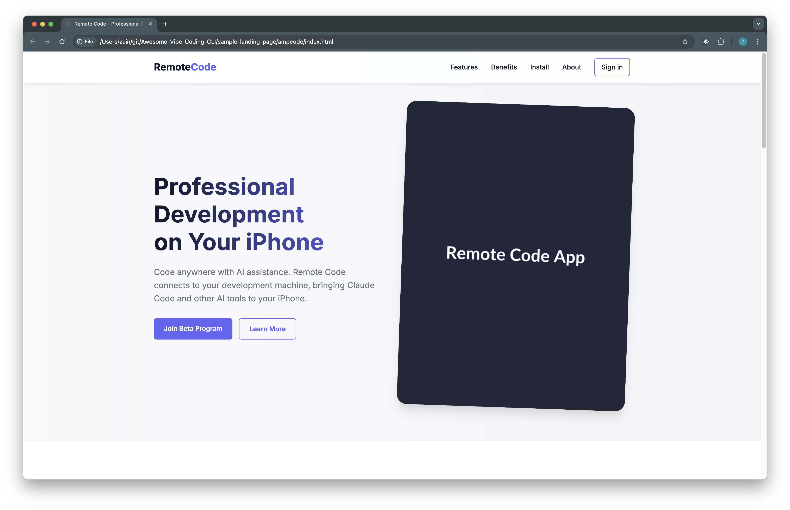
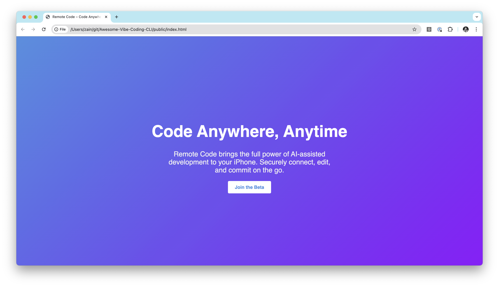
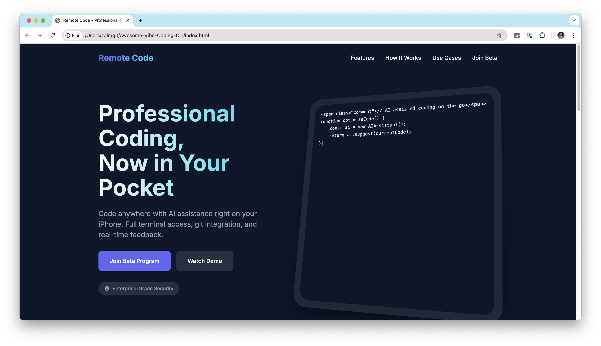

# Awesome Vibe Coding CLI

```bash   
  /\        _   _  _  ._ _   _   \  / o |_   _  
 /--\ \/\/ (/_ _> (_) | | | (/_   \/  | |_) (/_ 
  _                     _    ___                
 /   _   _| o ._   _   /  |   |                 
 \_ (_) (_| | | | (_|  \_ |_ _|_                
                   _|                           
```

> [!TIP]
> We are tracking all the tools that are compatible with [Remote-Code](https://remote-code.com/).


## Summary Table
| Tool | Compatible<br>Providers | Sample<br>Results |
|---|---|---|
| [Claude Code](https://github.com/anthropics/claude-code) | Anthropic |  Cost: $0.15 |
| [OpenAI Codex](https://github.com/openai/codex) | Many (OpenAI, OpenRouter, Gemini, Ollama, etc.) |  Cost: Unknown |
| [AmpCode](https://ampcode.com/) | Proprietary |  Cost: $0.27 |
| [Aider](https://github.com/Aider-AI/aider) | Many (OpenAI, Anthropic, DeepSeek, etc.) |  Cost: $0.02 |
| [Codebuff](https://www.codebuff.com) | Proprietary |  Cost: $1.11 |

The sample results above were generated from the following prompt:
> Read MARKETING.md and then make the best designed landing page for this product. Particularly focus on what's shown above the fold. Use this as an opportunity to showcase your design skills.

## Actively Maintained Tools
### Single Agent Tools
* **Claude Code**
    - https://github.com/anthropics/claude-code

* **OpenAI Codex**
    - https://github.com/openai/codex

* **Aider**
    - https://github.com/Aider-AI/aider
    - 33k stars on GitHub
    - Python-based

* **AmpCode**
    - https://ampcode.com/

* **Codebuff**
    - https://www.codebuff.com

* **Plandex**
    - https://github.com/plandex-ai/plandex
    - 13k stars on GitHub

* **OpenHands** (formerly OpenDevin)
    - https://github.com/All-Hands-AI/OpenHands
    - 37k stars on GitHub
    - AI-driven software development agent that can modify code, run commands, browse the web, and call APIs
    - Solves over 50% of real GitHub issues in software engineering benchmarks
    - Requires state-of-the-art LLMs (works best with Claude Sonnet 4)
    - Docker-based installation

* **Open Codex**
    - https://github.com/ymichael/open-codex
    - fork of OpenAI Codex that works with more LLMs

* **OpenCode**
    - https://github.com/sst/opencode
    - 6.7k+ stars on GitHub
    - AI coding agent built for the terminal
    - 100% open source and not coupled to any provider
    - Works with various LLM providers (Anthropic recommended, also supports OpenAI)

* **Raid**
    - https://github.com/ai-christianson/RA.Aid
    - "It is a standalone coding agent built on LangGraph's agent-based task execution framework. The tool provides an intelligent assistant that can help with research, planning, and implementation of multi-step development tasks. RA.Aid can optionally integrate with aider."

### Multi Agent Tools
* **Claude Squad**
    - https://github.com/smtg-ai/claude-squad
    - Claude Squad is a terminal app that manages multiple Claude Code, Codex (and other local agents including Aider) in separate workspaces, allowing you to work on multiple tasks simultaneously.

### Other Tools
* **Vibe Compiler (vibec)**
    - https://github.com/Strawberry-Computer/vibe-compiler
    - vibec is a unique compiler that processes markdown-based prompt stacks to generate code, tests, and documentation. It can compile itself through a bootstrap process, evolving its own implementation (bin/vibec.js) across numbered stages. The tool supports both static (.md) and dynamic (.js) plugins, maintains staged outputs in output/stacks/ for Git history, and aggregates the latest runtime version in output/current/ using a "Last-Wins" merge strategy.

* **AIChat**
    - https://github.com/sigoden/aichat
    - 6k stars, Rust-based

* **Cloi**
    - https://github.com/cloi-ai/cloi
    - AI CLI debugger

## Unmaintained Tools

* **Codai**
    - https://github.com/meysamhadeli/codai
    - Written in Go
    - Requires an embedding API

* **MyCoder**
    - https://github.com/drivecore/mycoder

* **AIAssist** 
    - https://github.com/mehdihadeli/AIAssist
    - dotnet based, requires some dotnet installation

* **GPT Engineer**
    - https://github.com/AntonOsika/gpt-engineer
    - OSS precursor to Loveable

* **Smol AI**
    - https://github.com/smol-ai/developer
